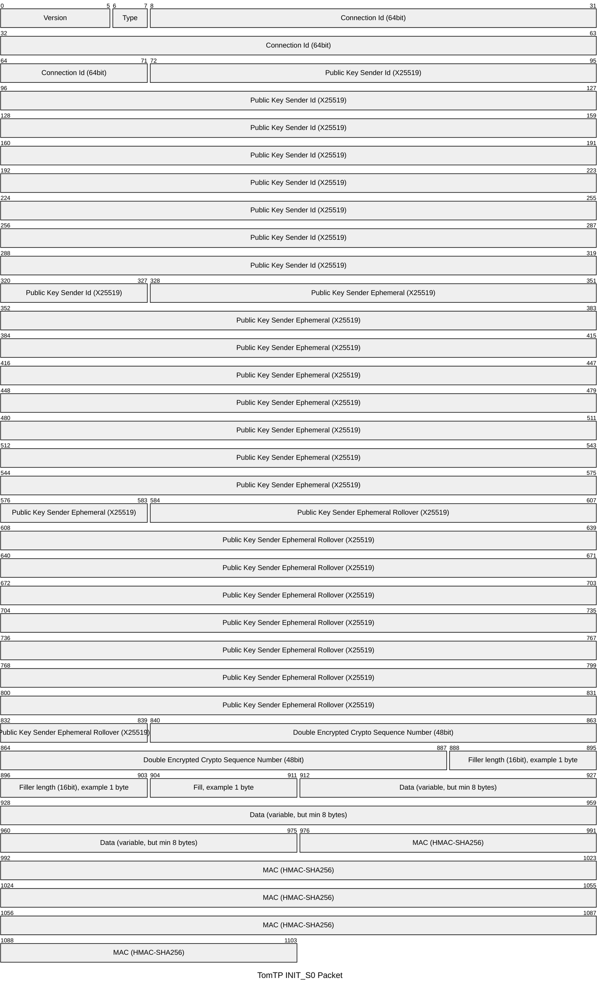
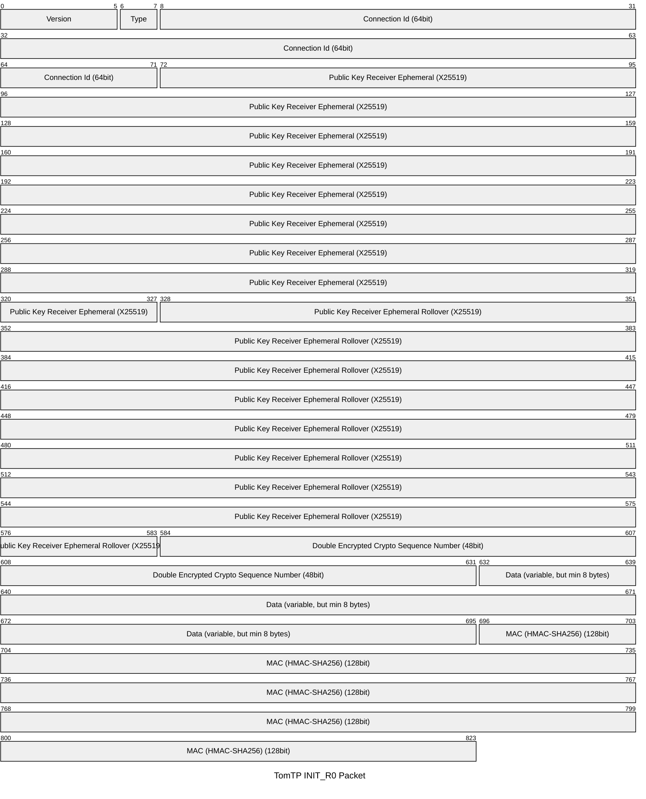
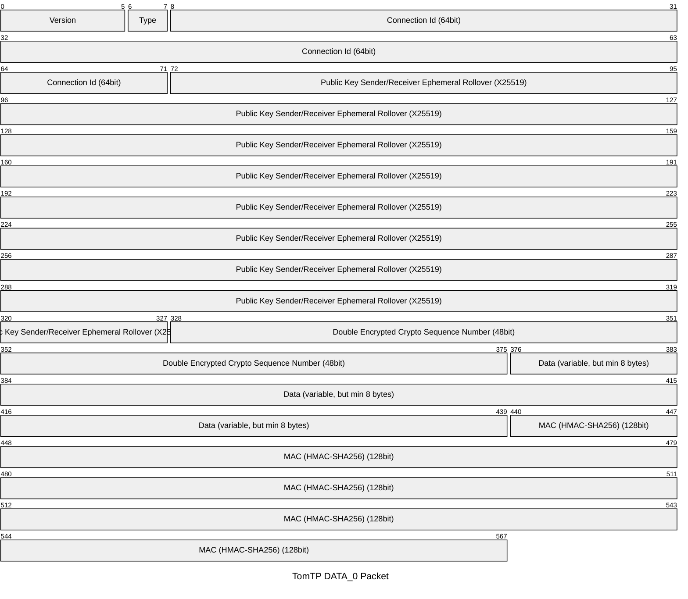
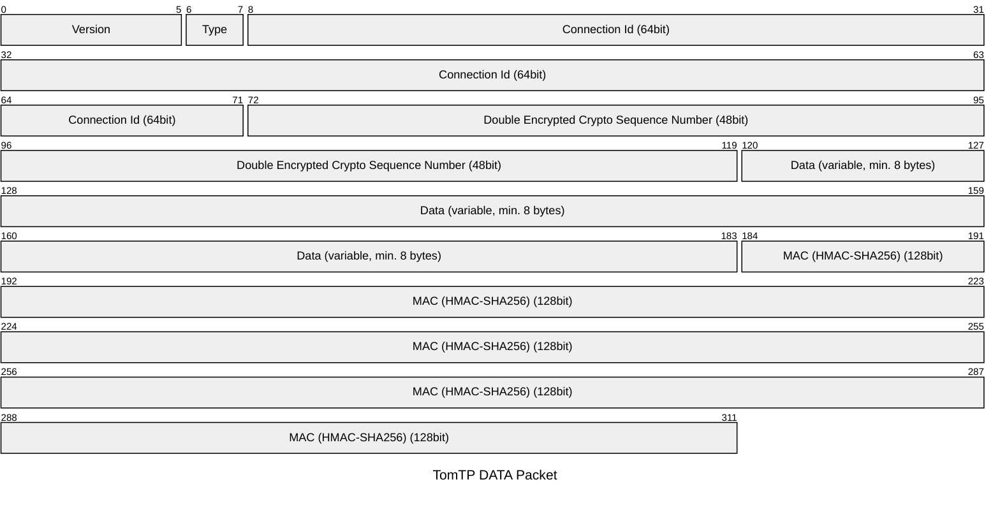
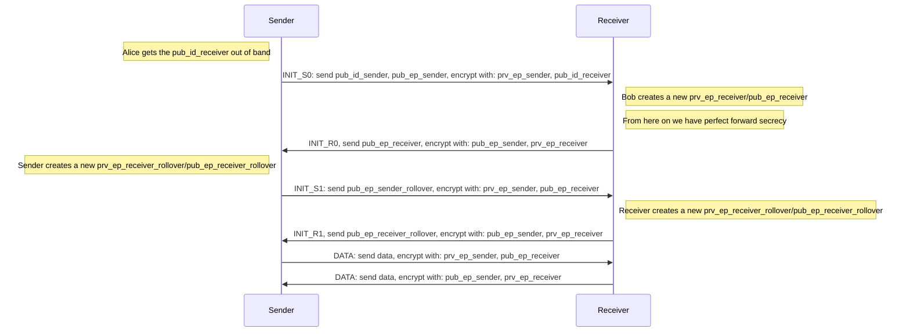
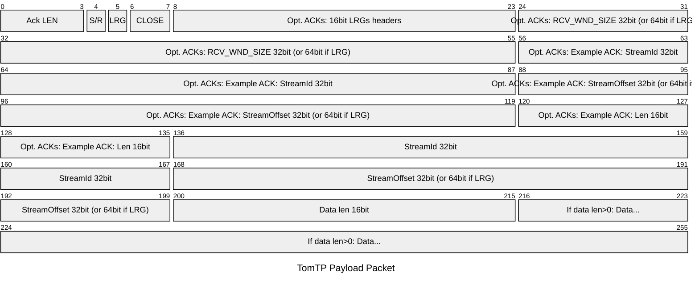
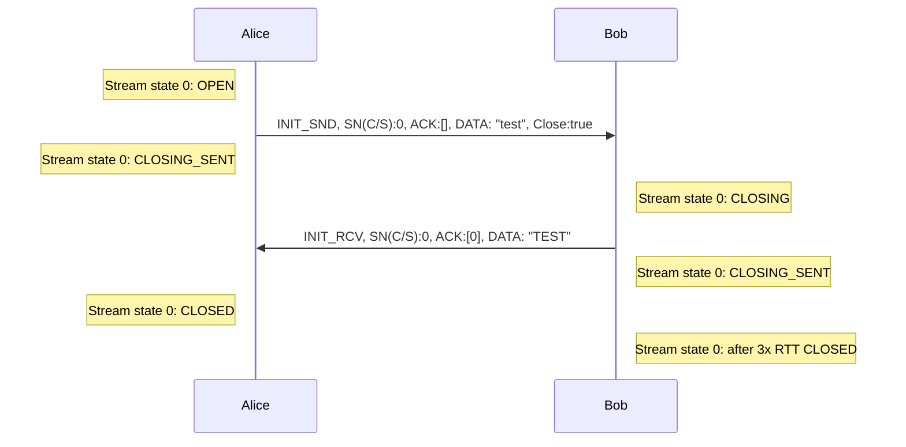

# TomTP

A UDP-based transport protocol that takes an "opinionated" approach, similar to QUIC but with a focus 
on providing reasonable defaults rather than many options. The goal is to have lower complexity, 
simplicity, and security, while still being reasonably performant.

TomTP is peer-to-peer (P2P) friendly, meaning a P2P-friendly protocol often includes easy integration
for NAT traversal, such as UDP hole punching, multi-homing, where data packets can come from different 
source addresses. It does not have a TIME_WAIT state that could exhaust ports and it does not open a socket
for each connection, thus allowing many short-lived connections.

## Similar Projects

* https://github.com/Tribler/utp4j
* https://github.com/quic-go/quic-go
* https://github.com/skywind3000/kcp (no encryption)
* https://github.com/johnsonjh/gfcp (golang version)
* https://eprints.ost.ch/id/eprint/846/
* https://eprints.ost.ch/id/eprint/879/
* https://eprints.ost.ch/id/eprint/979/

## Features / Limitations

* Public key of the recipient transfer is out of band (e.g., TXT field of DNS), not specified here. 
  Thus, for a connection you always need IP + port + public key
* Always encrypted (curve25519/chacha20-poly1305) - renegotiate of shared key on crypto sequence number overflow
* Support for streams 
* 0-RTT (first request always needs to be equal or larger than its reply -> fill up to MTU and no 
  perfect forward secrecy)
* User decides on perfect forward secrecy. 2 options: a) no perfect forward secrecy for 1st message 
  if payload is sent in first message (request and reply). b) perfect forward secrecy with empty first message  
* P2P friendly (id peers by ed25519 public key, for both sides)
* FIN/ACK teardown with timeout (no 3-way teardown as in TCP)
* Goal: less than 2k LoC

## Assumptions

* Every node on the world is reachable via network in 1s. Max RTT is 2sec
* Packets are identified with sequence offset + length (similar to QUIC). Length is 16bit, as an IP packet has a 
  maximum length of 64KB.
* Initial paket size is 1400 (QUIC has 1200).
* Receiver window max size is 48bit, which means that we can have a max window of 256 TiB per connection, which seems
  fine for the moment.
* Sequence offset is 64bit similar to QUIC with 62bit. Also, since packets are identified with
  offset/length and length is 16bit. Current buffer sizes for 100 Gb/s cards are 
  [2GB](https://fasterdata.es.net/host-tuning/linux/100g-tuning/), which is already the 
  maximum ([max allowed in Linux is 2GB-1](https://fasterdata.es.net/host-tuning/linux/)). So 32bit with 4GB is being 
  already the limit, and a new protocol needs to support more. What about 48bit? A worst case reorder with packets in 
  flight for 1sec is when the first packet arrives last and with a buffer of 2^48 bytes (256TB). Thus, what is the 
  in-flight bandwidth that can handle worst case for 1 second: 48bit is 2^48 * 8 -> 2.3 Pb/s
    * Current fastest speed: 22.9 Pb/s - multimode (https://newatlas.com/telecommunications/datat-transmission-record-20x-global-internet-traffic/)
    * Commercial: 402 Tb/s - singlemode (https://www.techspot.com/news/103584-blistering-402-tbs-fiber-optic-speeds-achieved-unlocking.html)
  So, 64bit should be enough for the foreseeable future.

## Messages Format (encryption layer)

Current version: 0

Available types:
* 00b: INIT_S0
* 01b: INIT_R0
* 10b: DATA_0 for rollover at crypto sequence number 0
* 11b: DATA (everything else)

The available types are encoded. We need to encode, as packets may arrive twice, and we need to know
how to decode them.

### Type INIT_S0, min: 137 bytes (113 bytes until payload + min payload 8 bytes + 16 bytes MAC)


### Type INIT_R0, min: 103 bytes (79 bytes until payload + min payload 8 bytes + 16 bytes MAC)


### Type DATA_0, min: 71 bytes (47 bytes until payload + min payload 8 bytes + 16 bytes MAC)


### Type DATA, min: 39 bytes (15 bytes until payload + min payload 8 bytes + 16 bytes MAC)


The length of the complete INIT_R0 needs to be same or smaller INIT_S0, thus we need to fill up the INIT message. 
The pubKeyIdShortRcv (first 64bit) XOR pukKeyIdShortSnd (first 64bit) identifies the connection Id (connId) for multi-homing.

The connection establishmet works as follows. The notation:

Id public key of Alice id: pub_id_alice
Id private key of Alice id: prv_id_alice
Ephemeral public key of Alice id: pub_ep_alice
Ephemeral private key of Alice id: prv_ep_alice



We need to store 3 shared keys at most. During rollover, if we received rollover packets and waiting for non-rollover packets,
we need to have both keys, and on rollover with the crypto sequence number 1, there will be new keys for the next rollover.
Thus, we need to store at most 3. 

### Double Encryption with Encoded Sequence Number

Similar to QUIC, TomTP uses a deterministic way to encrypt the sequence number and payload. However, TomTP uses twice
chacha20poly1305. The `chainedEncrypt` function handles the double encryption process for messages,
particularly focusing on encoding and encrypting the sequence number. Here's a detailed breakdown of how it works:

First Layer Encryption:

1. Create a deterministic nonce with the sequence number. TomTP uses 6 bytes for sequence numbers and ChaCha20-Poly1305
   uses a 12 bytes nonce. Thus, a sender puts its sequence number in the first 0-6 bytes, the receiver puts its 
   sequence number in the last 6-12 bytes to avoid collision. 
1. Use standard ChaCha20-Poly1305 to encrypt the payload data with this nonce
1. Include any header/crypto data as additional authenticated data (AAD) 
1. The resulting ciphertext must be at least 24 bytes to allow for nonce extraction

Second Layer Encryption:

1. Take the first 24 bytes (16bytes MAC + 8 bytes payload, hence we need a min. of 8 bytes payload) of the first 
encryption result as a random nonce
1. Use XChaCha20-Poly1305 to encrypt just the sequence number
1. Take only the first 6 bytes (48 bits) of this encrypted sequence number (we drop the MAC)

The final message structure is:

* Header/crypto data (unencrypted, but signed)
* Second layer ciphertext sequence number (6 bytes)
* First layer ciphertext (including authentication tag)

Decryption reverses this process using the same shared secret:

First Layer Sequence Number Decryption:

1. Extract the first 24 bytes from the first layer ciphertext as random nonce.
1. Use XChaCha20-Poly1305 with the shared secret to decrypt the 6-byte encrypted sequence number.
1. No authentication is needed since a wrong sequence number will cause the second layer to fail.

Second Layer Payload Decryption:

1. Generate the same deterministic nonce with the sequence number. (sender - 0-6 bytes, recipient 6-12 bytes)
1. Use standard ChaCha20-Poly1305 with this nonce and shared secret
1. Include the header/crypto data as additional authenticated data (AAD)
1. Decrypt and authenticate the first layer ciphertext
1. If authentication succeeds, return the decrypted sequence number and payload

The scheme ensures that tampering with either the sequence number or payload will cause authentication to fail during 
the second layer decryption. The deterministic nonce binds the sequence number to the payload, while the random nonce 
from the first encryption adds unpredictability to the sequence number encryption.

## Encrypted Payload Format (Transport Layer) - min. 8 Bytes (without data)

To simplify the implementation, there is only one payload header.


The TomTP payload packet begins with a header byte containing several control bits:

* Bits 0-3 contain the "Ack LEN" field, indicating the number of ACK entries (0-15).
* Bit 4 is the "S/R" flag which distinguishes between sender and receiver roles.
* Bit 5 is the "LRG" flag which, when set, indicates 64-bit offsets are used instead of 32-bit.
* Bits 6-7 form the "CLOSE" field for connection control (00: no close, 01: close stream, 10: close connection and all streams, 11: not used).

If ACKs are present (Ack LEN > 0), the following section appears:

* Bytes 8-23 contain an 16-bit LRGs header for ACK flags
* Bytes 24-55 hold the RCV_WND_SIZE, using 32 bits (or 64 bits if LRG is set)
* For each ACK entry:
  * Bytes 56-87 contain the StreamId (32 bits)
  * Bytes 88-119 hold the StreamOffset, using 32 bits (or 64 bits if LRG is set)
  * Bytes 120-135 contain the Len field (16 bits)

The Data section:

* Bytes 176-207 contain the StreamId (32 bits)
* Bytes 208-239 hold the StreamOffset, using 32 bits (or 64 bits if LRG is set)
* Bytes 240-255 contain the data length (16 bits)

Only if data length is greater than zero:

* Bytes 256-287 and beyond contain the actual data payload

This example shows the layout with 32-bit offsets (LRG=false), one ACK entry, and a 4-byte filler.

### Overhead
- **Total Overhead for Data Packets:**  
  double encrypted sn: 50 (39+11) bytes (for a 1400-byte packet, this results in an overhead of ~3.6%).

### Communication States

Small Request / Reply:



### LoC

```
echo "Source Code LoC"; ls -I "*_test.go" | xargs tokei; echo "Test Code LoC"; ls *_test.go | xargs tokei

Source Code LoC
===============================================================================
 Language            Files        Lines         Code     Comments       Blanks
===============================================================================
 Go                     12         2203         1773           89          341
 Markdown                1          177            0          133           44
===============================================================================
 Total                  13         2380         1773          222          385
===============================================================================
Test Code LoC
===============================================================================
 Language            Files        Lines         Code     Comments       Blanks
===============================================================================
 Go                      5         1366          959          195          212
===============================================================================
 Total                   5         1366          959          195          212
===============================================================================

```