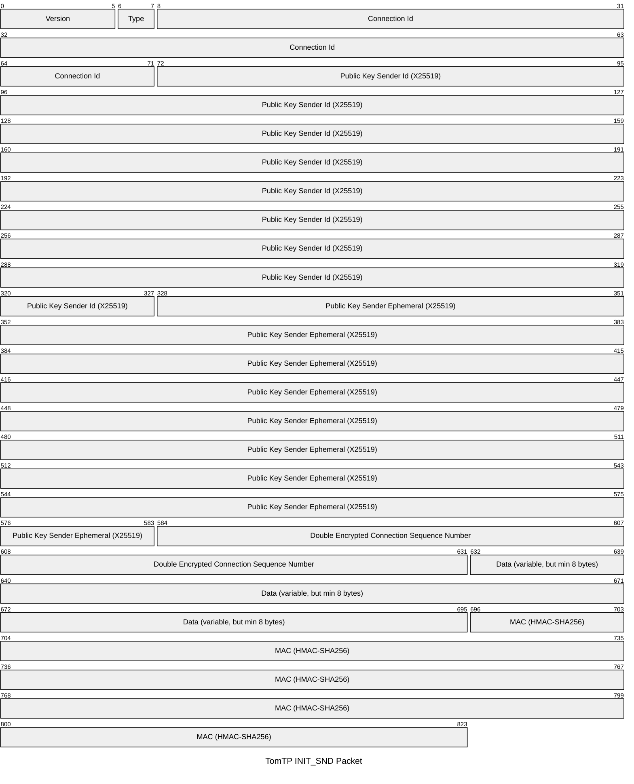
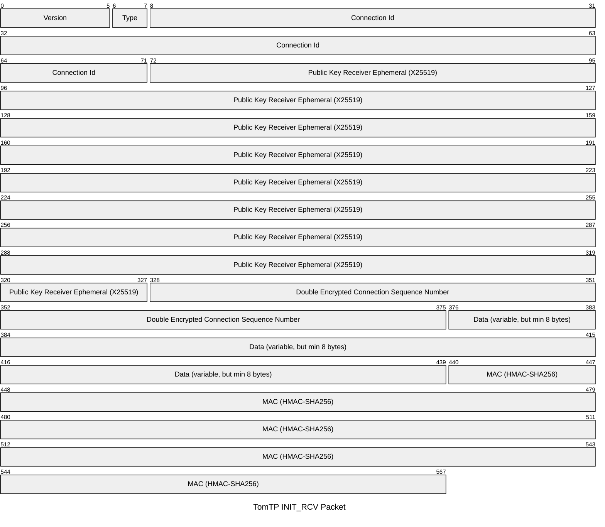
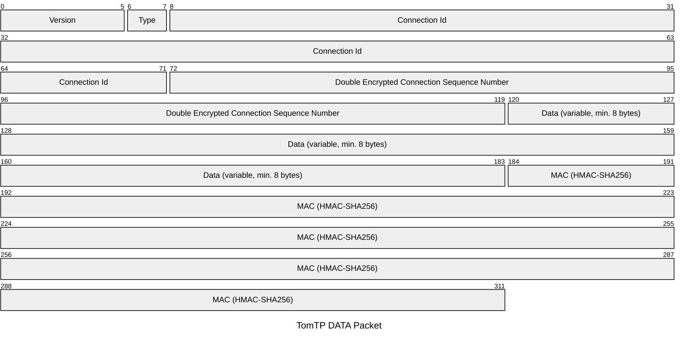
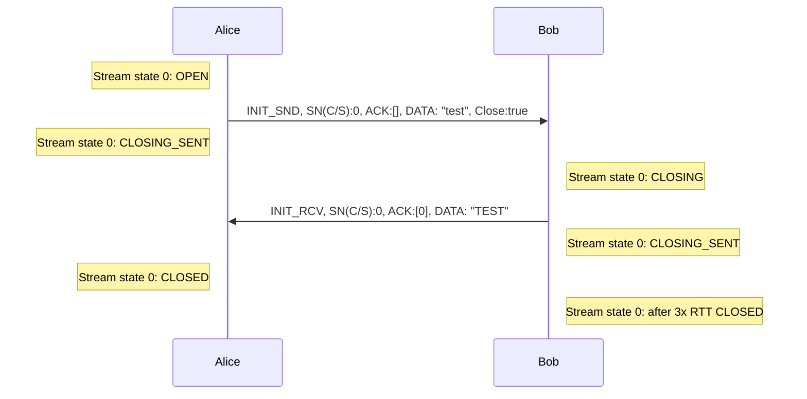

# TomTP

A UDP-based transport protocol that takes an "opinionated" approach, similar to QUIC but with a focus 
on providing reasonable defaults rather than many options. The goal is to have lower complexity, 
simplicity, and security, while still being reasonably performant.

TomTP is peer-to-peer (P2P) friendly, meaning a P2P-friendly protocol often includes easy integration
for NAT traversal, such as UDP hole punching, multi-homing, where data packets can come from different 
source addresses. It does not have a TIME_WAIT state that could exhaust ports and it does not open a socket
for each connection, thus allowing many short-lived connections.

## Similar Projects

* https://github.com/Tribler/utp4j
* https://github.com/quic-go/quic-go
* https://github.com/skywind3000/kcp (no encryption)
* https://github.com/johnsonjh/gfcp (golang version)
* https://eprints.ost.ch/id/eprint/846/
* https://eprints.ost.ch/id/eprint/879/
* https://eprints.ost.ch/id/eprint/979/

## Features / Limitations

* Always encrypted (curve25519/chacha20-poly1305) - renegotiate of shared key on sequence number overflow (tdb)
* Support for streams 
* 0-RTT (first request always needs to be equal or larger than its reply -> fill up to MTU and no 
  perfect forward secrecy)
* User decides on perfect forward secrecy. 2 options: a) no perfect forward secrecy for 1st message 
  if payload is sent in first message (request and reply). b) perfect forward secrecy with empty first message  
* P2P friendly (id peers by ed25519 public key, for both sides)
* FIN/ACK teardown with timeout (no 3-way teardown as in TCP)
* Less than 2k LoC, currently at 1.8k LoC

## Assumptions

* Every node on the world is reachable via network in 1s. Max RTT is 2sec
* Sequence nr is 48bit as a compromise of TCP with 32bit and QUIC with 62bit. A worst case reorder with packets in 
  flight with 1400 bytes size for 1sec is when the first packet arrives last. Thus, what is the in-flight bandwidth 
  that can handle worst case: 48bit is 2^48 * 1400 * 8 -> ~2.7 EB/sec
    * Current fastest speed: 22.9 Pbit/sec - multimode (https://newatlas.com/telecommunications/datat-transmission-record-20x-global-internet-traffic/)
    * Commercial: 402 Tbit/sec - singlemode (https://www.techspot.com/news/103584-blistering-402-tbs-fiber-optic-speeds-achieved-unlocking.html)

However, receiving window buffer is here the bottleneck, as we would need to store the unordered 
packets, and the receiving window size is 32bit. 2^32 * 1400 -> ~5.5 TB/sec. (TODO: still not sure if a 32bit sequence
number would be enough).

## Messages Format (encryption layer)

Current version: 0

Available types:
* 00b: INIT_SND (Initiating, without having the connId as state)
* 01b: INIT_RCV (Replying, without having the connId as state)
* 10b: DATA (everything else)
* 11b: unused

The available types are encoded. We need to encode, as packets may arrive twice, and we need to know
how to decode them.

### Type INIT_SND, min: 103 bytes (79 bytes until payload + min payload 8 bytes + 16 bytes MAC)


### Type INIT_RCV, min: 71 bytes (47 bytes until payload + min payload 8 bytes + 16 bytes MAC)


### Type DATA, min: 39 bytes (15 bytes until payload + min payload 8 bytes + 16 bytes MAC)


The length of the complete INIT_REPLY needs to be same or smaller INIT, thus we need to fill up the INIT message. 
The pubKeyIdShortRcv 64bit XOR pukKeyIdShortSnd 64bit identifies the connection Id (connId) for multi-homing.

### Double Encryption with Encoded Sequence Number

Similar to QUIC, TomTP uses a deterministic way to encrypt the sequence number and payload. However, TomTP uses twice
chacha20poly1305. The `chainedEncrypt` function handles the double encryption process for messages,
particularly focusing on encoding and encrypting the sequence number. Here's a detailed breakdown of how it works:

First Layer Encryption:

1. Create a deterministic nonce with the sequence number. TomTP uses 6 bytes for sequence numbers and ChaCha20-Poly1305
   uses a 12 bytes nonce. Thus, a sender puts its sequence number in the first 0-6 bytes, the receiver puts its 
   sequence number in the last 6-12 bytes to avoid collision. 
1. Use standard ChaCha20-Poly1305 to encrypt the payload data with this nonce
1. Include any header/crypto data as additional authenticated data (AAD) 
1. The resulting ciphertext must be at least 24 bytes to allow for nonce extraction

Second Layer Encryption:

1. Take the first 24 bytes (16bytes MAC + 8 bytes payload, hence we need a min. of 8 bytes payload) of the first 
encryption result as a random nonce
1. Use XChaCha20-Poly1305 to encrypt just the sequence number
1. Take only the first 6 bytes (48 bits) of this encrypted sequence number (we drop the MAC)

The final message structure is:

* Header/crypto data (unencrypted, but signed)
* Second layer ciphertext sequence number (6 bytes)
* First layer ciphertext (including authentication tag)

Decryption reverses this process using the same shared secret:

First Layer Sequence Number Decryption:

1. Extract the first 24 bytes from the first layer ciphertext as random nonce.
1. Use XChaCha20-Poly1305 with the shared secret to decrypt the 6-byte encrypted sequence number.
1. No authentication is needed since a wrong sequence number will cause the second layer to fail.

Second Layer Payload Decryption:

1. Generate the same deterministic nonce with the sequence number. (sender - 0-6 bytes, recipient 6-12 bytes)
1. Use standard ChaCha20-Poly1305 with this nonce and shared secret
1. Include the header/crypto data as additional authenticated data (AAD)
1. Decrypt and authenticate the first layer ciphertext
1. If authentication succeeds, return the decrypted sequence number and payload

The scheme ensures that tampering with either the sequence number or payload will cause authentication to fail during 
the second layer decryption. The deterministic nonce binds the sequence number to the payload, while the random nonce 
from the first encryption adds unpredictability to the sequence number encryption.

## Encrypted Payload Format (Transport Layer) - min. 8 Bytes (without data)

To simplify the implementation, there is only one payload header.


(CLS: close stream flag, CLC: close connection flag, S/R: indicates sender or receiver)
Bits 0-3 can have up to 15 StreamSn that can be acknowledged, 0 means, no ACKs.
StreamId MaxUint32 is used for filler.

We could use the conn sequence number for the acknowledgement, but then we would have another indirection in snd.go and 
adding complexity. Instead of 10 bytes, we could only use 6 bytes, but this is not worth the extra effort.

### Overhead
- **Total Overhead for Data Packets:**  
  double encrypted sn: 39+11 bytes (for a 1400-byte packet, this results in an overhead of ~3.5%).
  random data: 57+11 (for a 1400-byte packet, this results in an overhead of ~4.8%).

### Communication States

Small Request / Reply:



### LoC

```
echo "Source Code LoC"; ls -I "*_test.go" | xargs tokei; echo "Test Code LoC"; ls *_test.go | xargs tokei

Source Code LoC
===============================================================================
 Language            Files        Lines         Code     Comments       Blanks
===============================================================================
 Go                     12         2203         1773           89          341
 Markdown                1          177            0          133           44
===============================================================================
 Total                  13         2380         1773          222          385
===============================================================================
Test Code LoC
===============================================================================
 Language            Files        Lines         Code     Comments       Blanks
===============================================================================
 Go                      5         1366          959          195          212
===============================================================================
 Total                   5         1366          959          195          212
===============================================================================

```